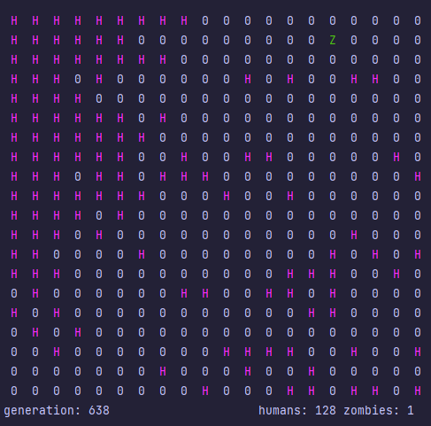

# EcoSim
C++ Assignment 4

* a 2D prey-preditor ecosystem simulator based on Savitch's 'Doodlebugs'
* the simulation has to stay balanced for around 100-200 generations
* the simulation cannot exceed 1000 generations

achieved the below results with 100 humans and 25 zombies to start!

>pictured above: final generation (humans prevail)
